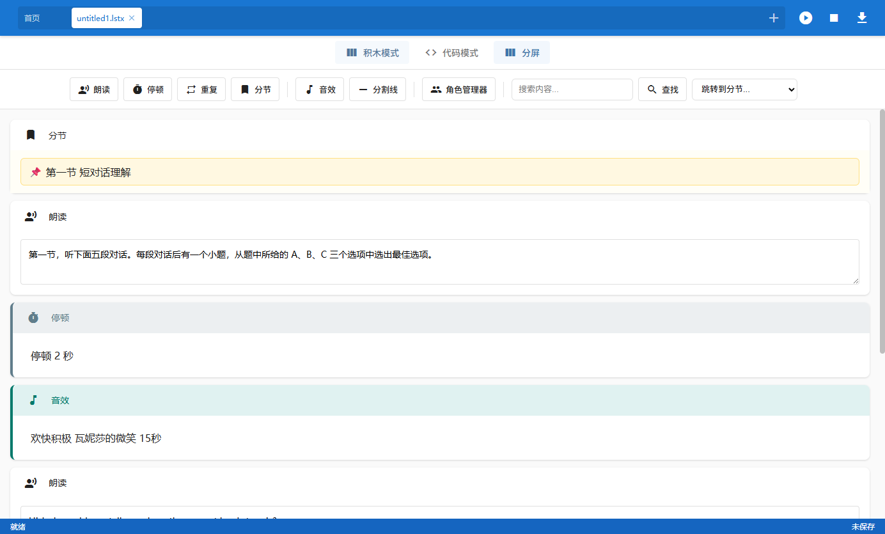
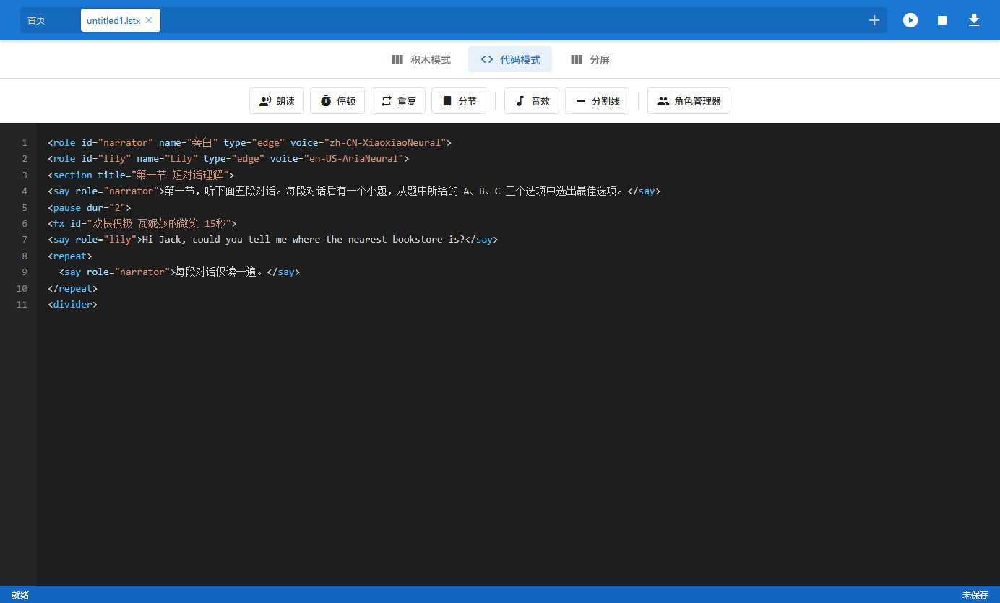
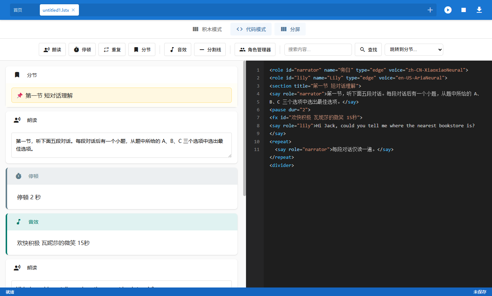

<p align="center">
  
</p>

<h1 align="center">亿方听力大师</h1>

<p align="center">
  <a href="https://github.com/XiaoYangTech/ListextEditor">GitHub</a> ·
  <a href="https://cnb.cool/InspireWorks/ListextEditor">CNB</a> ·
  <a href="https://www.yfyw.top/">官网</a>
</p>

<p align="center">跨平台的听力材料编辑与合成工具，会搭积木就能做听力，采用微软仿真语音引擎。</p>

---

## 简介

亿方听力大师（InspireWorks ListextEditor）是一款面向 K12 英语教学场景的听力材料制作工具，由开发过现象级开源教学软件《亿方教材助手》的亿方运维开发组开发。它把听力文本的编排、停顿、重复、音效和角色发音整合在一个编辑器里，帮助老师高效率地制作出完整的听力音频。新项目，新起点，风华依旧。

软件提供 Windows、macOS、Linux（含信创平台）三个平台的安装包，项目文件以 `.lstx` 格式自包含保存，可以在不同电脑之间直接迁移。

## 界面截图

<p align="center">
  <br>
  积木模式：拖拽积木块编排听力内容，无需写代码
</p>

<p align="center">
  <br>
  代码模式：类 HTML 标签语法，纯键盘高效编辑
</p>

<p align="center">
  <br>
  分屏模式：积木与代码左右分屏，双向实时同步
</p>

## 功能特性

- **三种编辑模式**：积木模式 / 代码模式 / 分屏模式（左右分屏，双向实时同步）
- **类 HTML 标签语法**：`say`、`pause`、`repeat`、`fx`、`divider`、`section`、`role`
- **音效管理**：默认音效库 + 用户音效分组管理，支持导入、试听、重命名
- **角色与发音人**：角色管理器统一管理发音人，支持 EdgeTTS，Windows 下还支持系统 TTS
- **小语种支持**：满足新高考小语种听力制作需求
- **项目打包**：`.lstx` 项目文件（zip 格式），内含 `project.json` 与全部引用音效，自包含不依赖本机音效库
- **分节导航**：分节锚点快速跳转，支持关键字搜索定位

## 下载安装

前往 Releases 页面下载对应平台的安装包：

- [GitHub Releases](https://github.com/XiaoYangTech/ListextEditor/releases)
- [CNB Releases](https://cnb.cool/InspireWorks/ListextEditor/-/releases)（国内镜像，同步更新）

| 平台 | 安装包 |
|------|--------|
| Windows | `ListextEditor-x.x.x-Setup.exe` |
| macOS | `ListextEditor-x.x.x-x64.dmg`（Intel）/ `ListextEditor-x.x.x-arm64.dmg`（Apple Silicon） |
| Linux | `ListextEditor-x.x.x-x64.AppImage` / `.deb`，另有 arm64 架构包 |

## 快捷键（积木模式）

所有快捷键均可在「设置 → 快捷键」中自定义。

| 快捷键 | 功能 |
|--------|------|
| `Ctrl + 1~6` | 新增 朗读/停顿/重复/分节/音效/分割线 块（Shift 控制插入位置） |
| `↑ / ↓` | 选中上一个/下一个积木块 |
| `Ctrl + ↑ / ↓` | 上移/下移当前选中块 |
| `Enter` | 编辑当前选中块 |
| `Delete / Backspace` | 删除选中块 |
| `Space` | 预览播放 |
| `Ctrl + Z / Ctrl + Shift + Z` | 撤销 / 重做 |
| `Ctrl + C / X / V / A` | 复制 / 剪切 / 粘贴 / 全选 |
| `Ctrl + S` | 保存项目 |
| `Ctrl + M` | 切换积木/代码/分屏模式 |
| `Ctrl + N` | 新建标签页 |
| `Ctrl + Shift + E` | 打开音效管理器 |
| `F5`（可自定义） | 预览播放 |
| `Esc` | 停止播放并关闭弹窗 |

代码模式下：`Ctrl + 1~6` 插入对应标签模板，`Tab` 缩进/取消缩进，其余为原生文本编辑器行为。

## 本地开发

```bash
npm install   # 安装依赖
npm start     # 启动开发版
```

## 构建安装包

```bash
npm run build:win:x64      # Windows
npm run build:mac          # macOS（同时输出 x64 和 arm64）
npm run build:linux:x64    # Linux x64（Intel/AMD、兆芯、海光）
npm run build:linux:arm64  # Linux ARM64（含飞腾）
npm run build:all          # 全平台串行构建
```

## 音效与配置策略

- 默认音效随安装包携带（`assets/default-sounds`）
- 用户导入的音效写入用户目录（`userData/sounds-user`），与默认库隔离
- 用户配置写入 `userData`，不污染安装目录

## 免费运营与赞助

自 v1.1.9 起，亿方听力大师进入**免费运营模式**：全部功能免费开放，无会员、无配额、无强制水印。软件的持续运营与维护需要成本，如果觉得本软件好用，欢迎扫码捐助，支持项目继续走下去。

<p align="center">
  
  &nbsp;&nbsp;&nbsp;&nbsp;
  
  <br>
  <sub>支付宝 · 微信</sub>
</p>

## 许可证与免责声明

本项目基于 [GPL-3.0](LICENSE) 开源。

本工具面向教学与听力材料制作场景，建议在受控环境中使用并定期备份项目文件。本工具使用了国内可访问的合法 AI 模型，用户使用本工具制作的任何内容与本项目无关，不代表本项目及相关合作者立场。项目中提供的素材文件系网络搜集制作，禁止用于商业化场景，如有侵权请联系删除。

## 贡献名单

感谢以下人员的贡献：

[@玄离199](https://space.bilibili.com/67079745)：为项目提供AI大模型资源，并提供精神上的鼓励和支持及项目方向的指导。